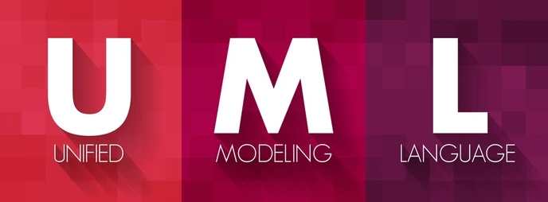

# Sistema de gestión de requerimientos y documentación UML
## Universidad Privada de Tacna
### Curso: Calidad y Pruebas de Software

---

### 🎓  **Integrantes**  🎓

- **Ancco Suaña, Bruno Enrique**

- **Antayhua Mamani, Renzo Antonio** 

- **Colque Ponce, Sergio Alberto**

---

## 1. ¿Cuál es el problema? 📌

En el desarrollo de software, uno de los principales factores de fracaso en los proyectos es la definición inadecuada de requerimientos. Debido a que en la actualidad:

- Muchos equipos documentan requerimientos de forma manual, poco estructurada o sin seguir estándares.
- No se utilizan herramientas para asegurar la coherencia, claridad o completitud de los requerimientos.
- La generación de diagramas UML suele ser un proceso separado y manual, lo cual dificulta la trazabilidad.
- Las empresas carecen de mecanismos que aseguren la calidad y mantenimiento actualizado de la documentación técnica.

Esto genera ambigüedades, retrabajo, mala comunicación entre áreas y productos finales que no cumplen con lo requerido.  

---

## 2. ¿A quiénes afecta? ¿A cuántos? 👨‍💻

- **Analistas de sistemas:** Encargados de definir los requerimientos de manera precisa.
- **Desarrolladores:** Requieren documentación clara para codificar adecuadamente.
- **Gerentes de proyecto:** Necesitan supervisar y validar el cumplimiento de los requisitos.
- **Usuarios finales:** Se ven afectados por la mala interpretación o implementación de sus necesidades.

Este problema impacta a equipos completos de desarrollo de software tanto en empresas privadas como en instituciones educativas.

---

## 3. ¿Se puede resolver completamente con tecnología? 💻 

### **Soluciones tecnológicas propuestas:**

- Plataforma centralizada para captura, análisis y documentación de requerimientos.
- Sugerencias automáticas para mejorar redacción y claridad de los requerimientos.
- Generación automática de diagramas UML (casos de uso, clases, secuencia, etc.).
- Exportación a múltiples formatos como PDF, Word, JSON y Markdown.
- Cumplimiento de estándares internacionales como IEEE 830 y UML 2.5.

---

### **Limitaciones:**
- Es necesario **capacitar al personal** para el uso del sistema.
- Depende de la **infraestructura tecnológica** disponible.
- **Factores humanos** como el uso incorrecto o fallas en el sistema pueden afectar su eficiencia.

---
## 4. Conclusión 📌
El Sistema de Gestión de Requerimientos y Documentación UML representa una solución tecnológica eficaz que mejora significativamente la calidad de los requerimientos, fomenta la colaboración entre roles del equipo y agiliza la generación de documentación técnica estandarizada. Su implementación contribuye directamente a proyectos de software más eficientes, claros y exitosos.

---

## **¡Gracias!** 🎓
